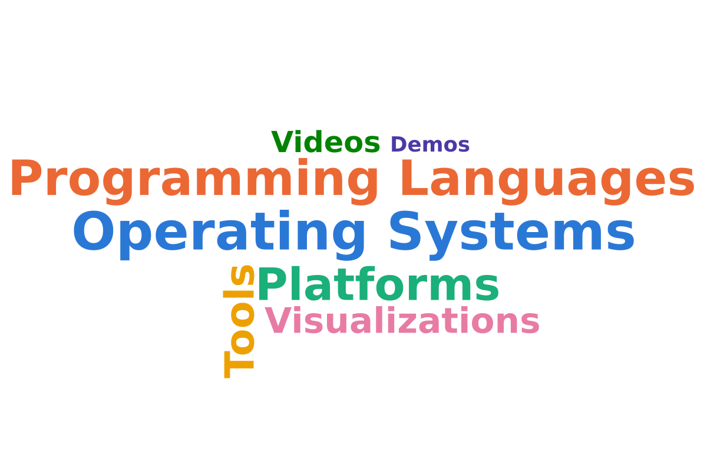

# wordcloud

A small Rust CLI that turns a list of words or phrases into a colored word
cloud, as PNG or SVG. No runtime dependencies: the font is bundled.



## Build

```sh
cargo build --release
# binary: target/release/wordcloud
cargo install --path .   # optional: put `wordcloud` on your PATH
```

## Usage

```sh
wordcloud "Operating Systems" "Programming Languages" "Platforms" "Tools" "Visualizations" "Videos" "Demos"
# -> wordcloud.png (1200x800, white background)
```

Each argument is one entry; quote multi-word phrases. By default the first
word is largest and sizes decrease in the order given. Words are grown to
fill the canvas without overlapping.

```sh
# SVG output, dark background, different palette
wordcloud -o cloud.svg --palette sunset --bg charcoal Rust Go Zig

# Explicit weights: bigger number = bigger word
wordcloud "Rust=5" "Go=3" "Zig=1"

# Reproducible layout, all horizontal, equal sizes, square canvas
wordcloud --seed 42 --vertical 0 --sizing equal -W 800 -H 800 Alpha Beta Gamma
```

### Options

| Flag | Default | Meaning |
|---|---|---|
| `-o, --output <file>` | `wordcloud.png` | Output path; `.svg` extension writes SVG |
| `-f, --format png\|svg` | from extension | Force the output format |
| `-W, --width`, `-H, --height` | 1200 x 800 | Canvas size in pixels |
| `-p, --palette <name\|list>` | `vivid` | `vivid`, `pastel`, `ocean`, `sunset`, `mono`, or `#hex,#hex,...` |
| `-b, --bg <color>` | `white` | Background: name or hex. Dark backgrounds switch to dark-tuned palette steps |
| `-t, --transparent` | off | Transparent background |
| `-s, --sizing ordered\|equal\|random` | `ordered` | How unweighted words are sized |
| `--max-size`, `--min-size` | fill / 16 | Font size bounds in pixels |
| `-v, --vertical <0..1>` | 0.3 | Fraction of words drawn rotated 90 degrees |
| `--padding <px>` | 6 | Minimum gap between words |
| `--seed <n>` | time-based | Reproducible layout and colors |
| `--shuffle-colors` | off | Random palette assignment instead of in order |
| `--verbose` | off | Print seed and placements to stderr |

Run `wordcloud --help` for the full list.

## How it works

1. Each word gets a weight (from `word=N`, or from `--sizing`) and a nominal
   font size proportional to the square root of its weight.
2. Words are placed largest-first along an Archimedean spiral from the center,
   using tight glyph bounding boxes for collision detection.
3. A common scale factor is searched so every word fits and the cloud fills
   the canvas as fully as possible.
4. PNG output rasterizes glyphs with `ab_glyph` and alpha-blends them; SVG
   output writes `<text>` elements at the same positions.

SVG files reference "DejaVu Sans" and fall back to Verdana or a generic
sans-serif. A wider fallback font can make neighboring words touch; PNG output
is always exact.

## Font

`assets/DejaVuSans-Bold.ttf` is embedded at build time. DejaVu is free to
redistribute; see `assets/LICENSE-DejaVu.txt`.

## Tests

```sh
cargo test
```

## License

MIT — Copyright (c) 2026 Michael A Wright. See [LICENSE](LICENSE) and [COPYRIGHT](COPYRIGHT).
The bundled DejaVu font has its own license in `assets/LICENSE-DejaVu.txt`.
